 

# İlk PR'ım (Pull Request)

## Türkçe

Bu repo, açık kaynak bir projeye katkı sağlamak isteyen kişinin ilk PR'ını atmasına yardımcı olmayı amaçlar.

Açık kaynak bir projeye destek vermeye karar verdiğinizde, nereden başlayacağınızı bilememeniz normaldir.
İlk seferinizde, birçok insanın çalıştığı bir projeye girmek de gözünüzü korkutabilir.
Bu reponun amacı, ilk seferinizde size yol gösterici olmak ve sizi bir *Açık Kaynak Geliştiricisi* yapmaktır.
Şunu unutmayın ki, ilk seferinizde hata yapmak oldukça doğaldır ve kimse sizi yadırgamaz. (Yadırgayan olursa da bu onların yanlışıdır)

Gelin şimdi ilk katkınızı, bu repoya kullanıcı adınızı ekleyen bir PR atarak başlayalım.

### Projeyi Forklama

GitHubda, herhangi bir açık kaynak projenin kopyasını, kendi hesabımıza ekleyebiliriz.
Bu işleme **fork** denir.

Şimdi biz de bu projeyi forkluyoruz:

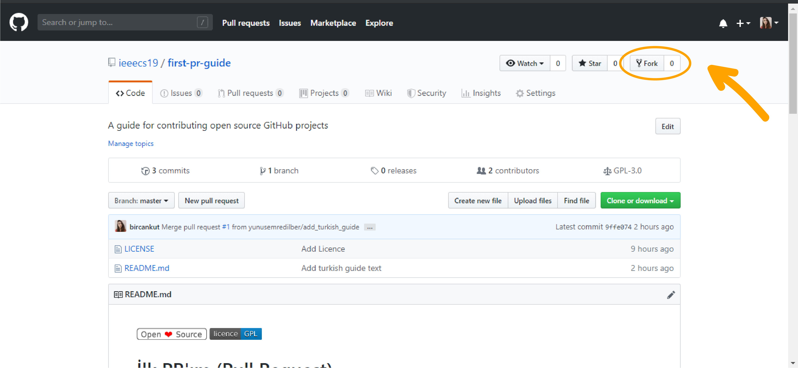

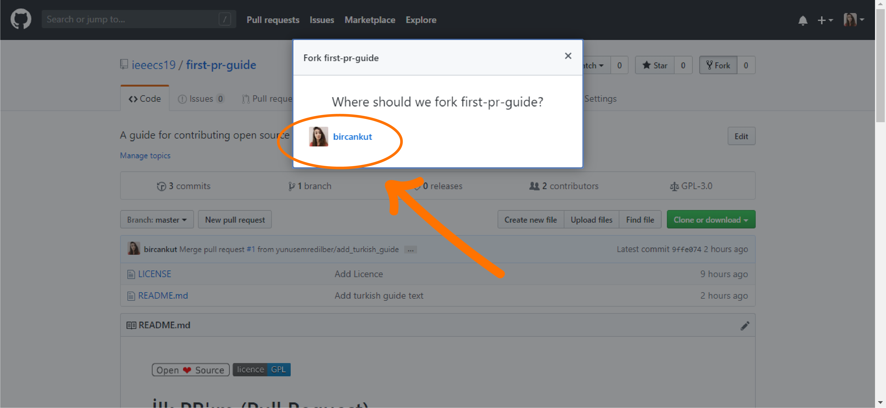

### Projeyi Klonlama

Artık projeyi forkladığımıza göre, üzerinde çalışmak için projeyi lokalimize çekmeli, yani dosyaları indirmeliyiz.
Bu işleme de **clone** denir.

Forkladığımız projeyi lokalimize klonlayalım:

**Github Destkop**

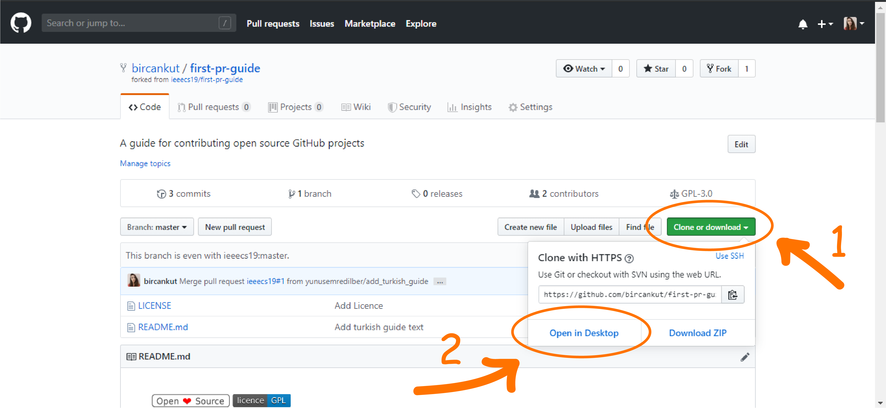

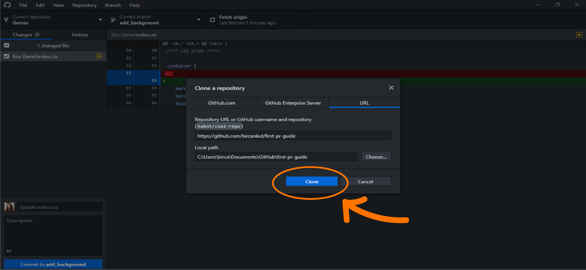

**Komut Satırı**

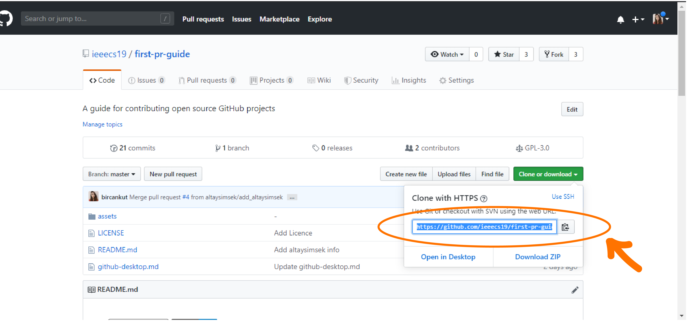

Gösterilen yerdeki kodu kopyalayınız.

`> git clone <kopyaladığınız_ifade>`

`> cd first-pr-guide`

### Yeni Branch'a Geçme

Geliştireceğimiz özellik veya yapacağımız işlem için, yeni bir branch'a geçmeliyiz.
Branch, aynı repo üzerinde, kendimizde özel bir dallanmadır.
Bu dalda geçerek, orjinal dala zarar vermeden veya başka birinin kodumuzu değişikliğe uğratma kaygısı olmadan çalışabiliriz.

Şimdi add_*kullanıcı_adınız* isimli bi branch oluşturup bu brancha geçelim:

**Github Destkop**

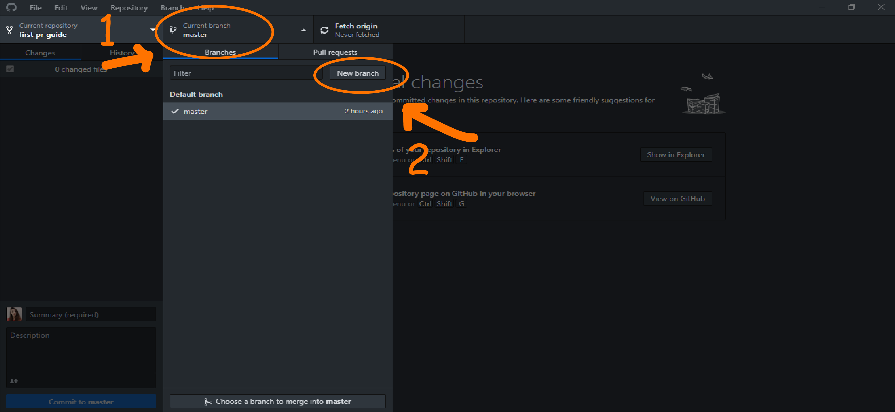

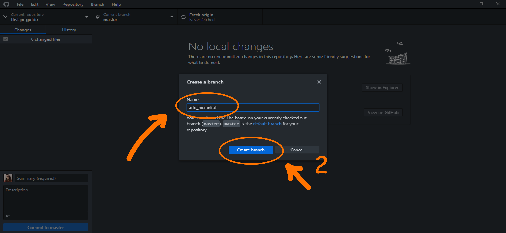

**Komut Satırı**

`> git checkout -b add_<kullanıcı_adınız>`

### Gerekli değişiklikleri yapıp bu değişiklikleri commitleme

Artık tek yapmamız gereken kodda gerekli değişiklikleri yapmak.
Gerekli değişiklikleri istediğimiz herhangi bir text editörü veya IDE'de yaptıktan sonra, bu değişikikleri commitliyoruz.
Commitleri, kodun gelişim çizelgesindeki işaretlemelere benzetebilirsiniz.
Bu işaretler sayesinde nerde neyin yapıldığını inceleyebilir veya istersek bu işaretlemeler geri dönebiliriz.

Şimdi kullanıcı adımızı ve linkimizi ekleyip commitleyelim.
Commit mesajımıza ise "Add *kullanıcı_adınız* info" yazalım:

**Github Destkop**

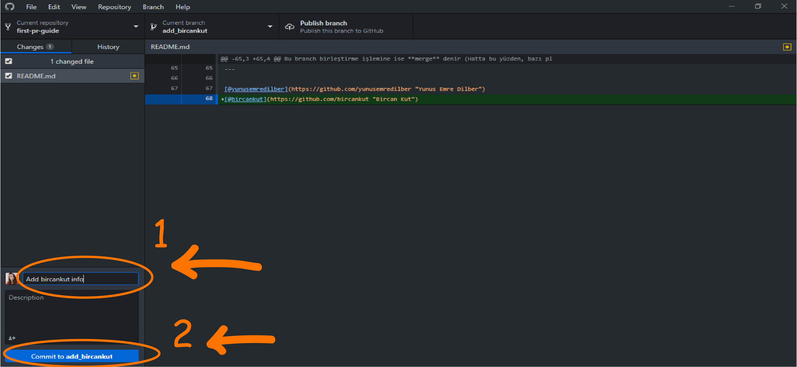

**Komut Satırı**

`> git add .`
`> git commit -m "Add <kullanıcı_adınız> info"`

### Değişiklikleri GitHub'a Pushlama

Lokalimizde yaptığımız değişiklikleri GitHubdaki repomuza gönderebiliriz.
Bu gönderme işlemine ise **push** denir.

Değişikliklerimizi pushlayalım:

**Github Destkop**

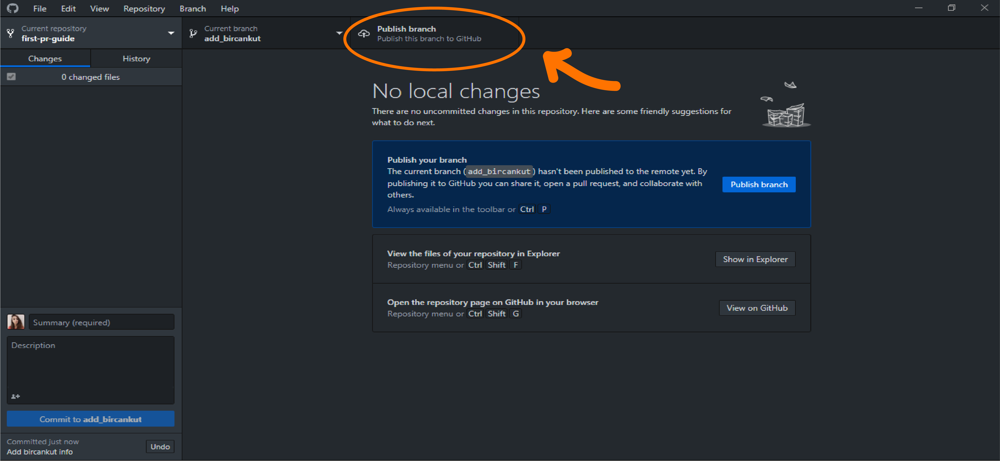

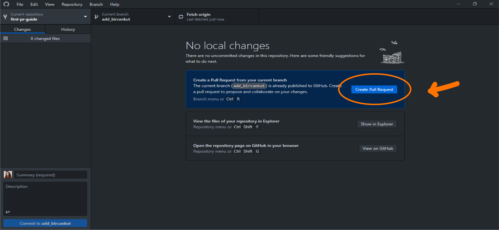

**Komut Satırı**

`> git push`

Bu komuttan sonra git bize hata verip asıl çalıştırmamız gereken komutu vericek.
Bu komutu kopyalayıp çalıştıralım.

Bize gelen çıktıda pr açmamız için gerekli link de gelicek.
Bu linke tıklayarak pr açma sayfasınza gidebiliriz.

### Pull Request (PR) Açma

Artık tek yapmamız gereken, kendi forkumuzdaki branch'ı, orjinal repoyla birleştirmek.
Ama tabiki proje bizim olmadığı için bu işi pat diye yapamayız (Ama nazikçe isteyebiliriz :smile: ).
İşte bu nazik isteğe **pull request** denir.
İşin özünde, bizim forkumuzdaki branch ile ana projenin asıl branchını birleşitirmek istiyoruz k,i yaptığımız değişiklikler asıl projeyi de etkilesin.
Bu branch birleştirme işlemine ise **merge** denir (Hatta bu yüzden, bazı platformlar pull request'e *merge request* der).

Şimdi, ilk Pull Requestimizi açalım:

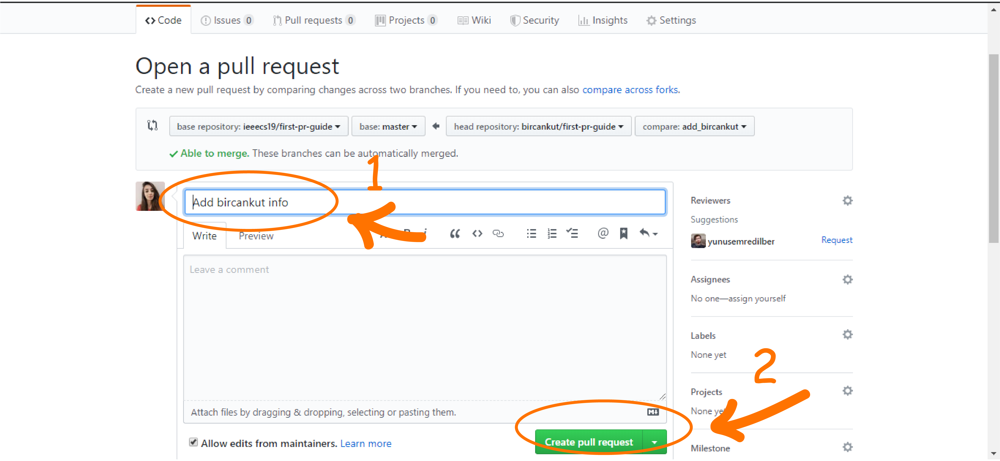

---

[@yunusemredilber](https://github.com/yunusemredilber "Yunus Emre Dilber")
[@bircankut](https://github.com/bircankut "Bircan Kut")
[@altaysimsek](https://github.com/altaysimsek "Altay Şimşek")
