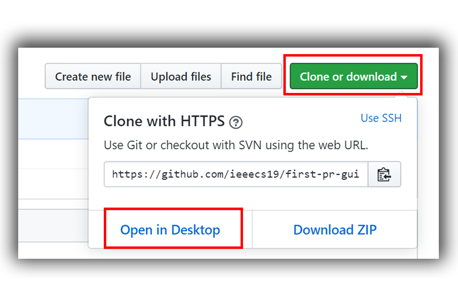
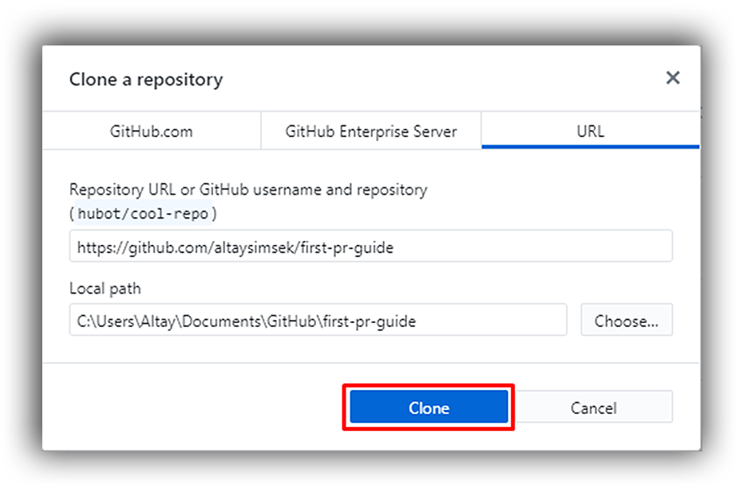
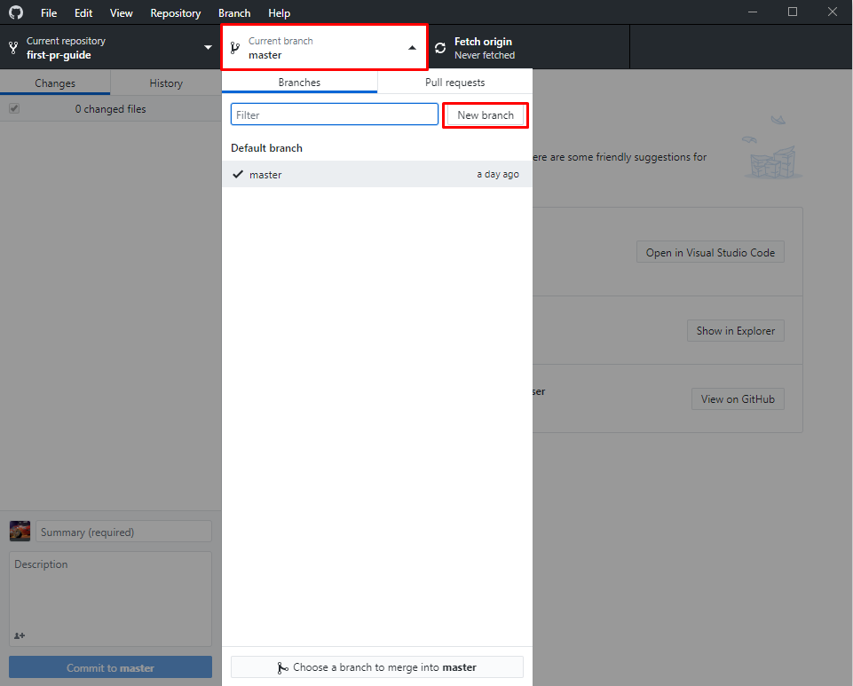
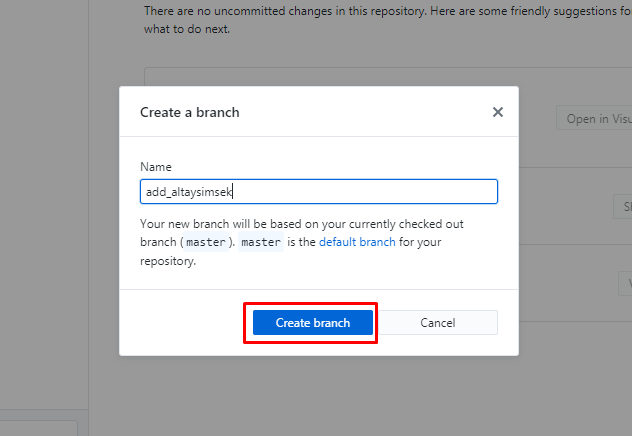
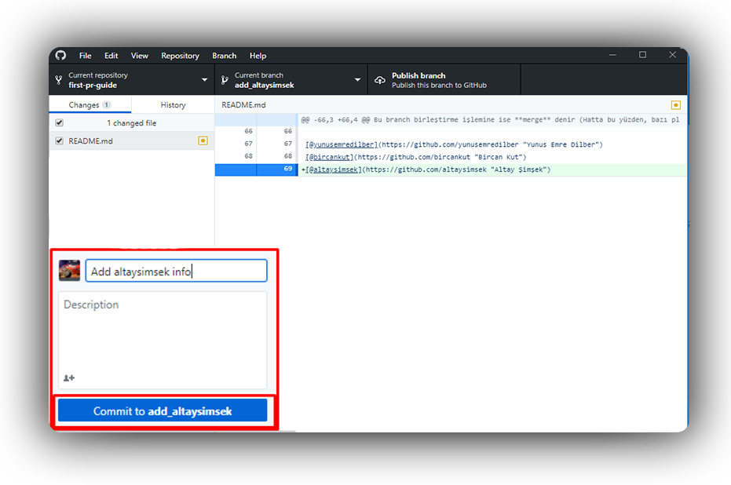
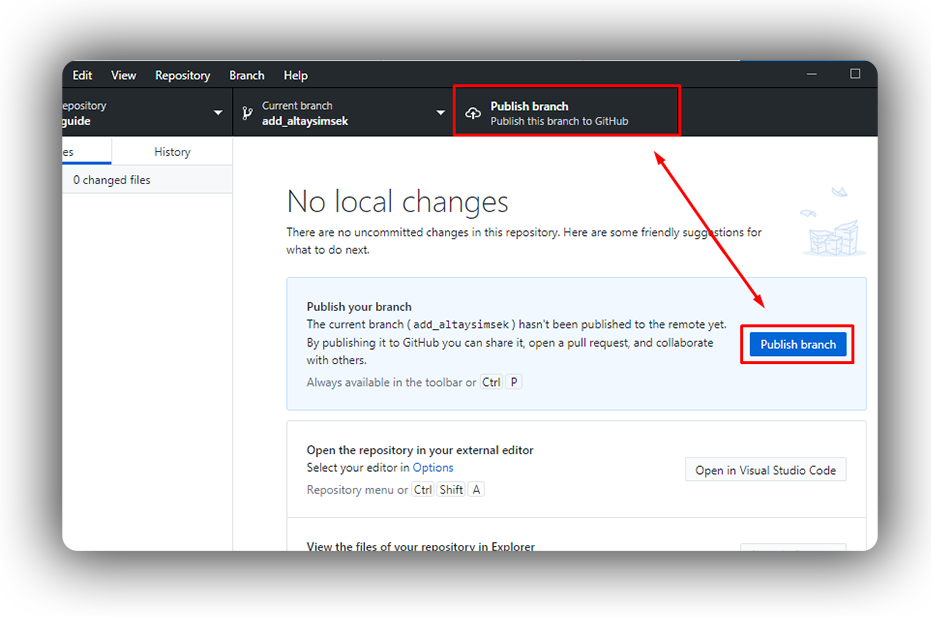
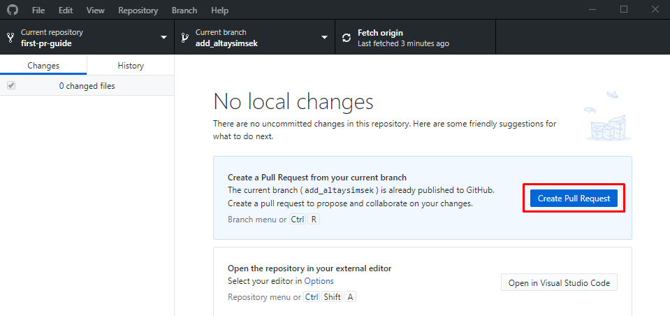
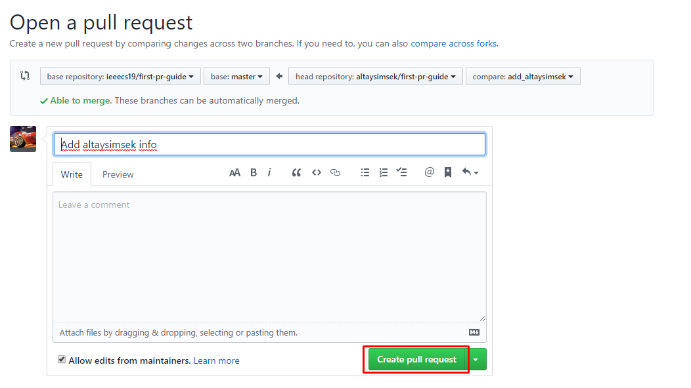

# İlk PR'ım (Pull Request)

### Github Desktop kullanarak ilk PR'ım

### Projeyi Forklama

GitHubda, herhangi bir açık kaynak projenin kopyasını, kendi hesabımıza ekleyebiliriz.
Bu işleme **fork** denir.

## Projeyi Klonlama

Artık projeyi forkladığımıza göre, üzerinde çalışmak için projeyi lokalimize çekmeli, yani dosyaları indirmeliyiz.
Bu işleme de **clone** denir.

## Yeni Branch'a Geçme

Geliştireceğimiz özellik veya yapacağımız işlem için, yeni bir branch'a geçmeliyiz.
Branch, aynı repo üzerinde, kendimizde özel bir dallanmadır.
Bu dalda geçerek, orjinal dala zarar vermeden veya başka birinin kodumuzu değişikliğe uğratma kaygısı olmadan çalışabiliriz.

Şimdi add_*kullanıcı_adınız* isimli bi branch oluşturup bu brancha geçelim:

## Gerekli değişiklikleri yapıp bu değişiklikleri commitleme

Artık tek yapmamız gereken kodda gerekli değişiklikleri yapmak.

    README.md dosyasının sonuna ekleyiniz.
    [@isminiz](https://github.com/isminiz "İsminiz")

Gerekli değişiklikleri istediğimiz herhangi bir text editörü veya IDE'de yaptıktan sonra, bu değişikikleri commitliyoruz.

Commitleri, kodun gelişim çizelgesindeki işaretlemelere benzetebilirsiniz.
Bu işaretler sayesinde nerde neyin yapıldığını inceleyebilir veya istersek bu işaretlemeler geri dönebiliriz.

Şimdi kullanıcı adımızı ve linkimizi ekleyip commitleyelim.
Commit mesajımıza ise "Add *kullanıcı_adınız* info" yazalım:

### Değişiklikleri GitHub'a Pushlama

Lokalimizde yaptığımız değişiklikleri GitHubdaki repomuza gönderebiliriz.
Bu gönderme işlemine ise **push** denir.

Değişikliklerimizi pushlayalım:

------------
### Pull Request (PR) Açma

Artık tek yapmamız gereken, kendi forkumuzdaki branch'ı, orjinal repoyla birleştirmek.
Ama tabiki proje bizim olmadığı için bu işi pat diye yapamayız (Ama nazikçe isteyebiliriz :smile: ).
İşte bu nazik isteğe **pull request** denir.
İşin özünde, bizim forkumuzdaki branch ile ana projenin asıl branchını birleşitirmek istiyoruz k,i yaptığımız değişiklikler asıl projeyi de etkilesin.
Bu branch birleştirme işlemine ise **merge** denir (Hatta bu yüzden, bazı platformlar pull request'e *merge request* der).

Şimdi, ilk Pull Requestimizi açalım:

---
[@yunusemredilber](https://github.com/yunusemredilber "Yunus Emre Dilber")

